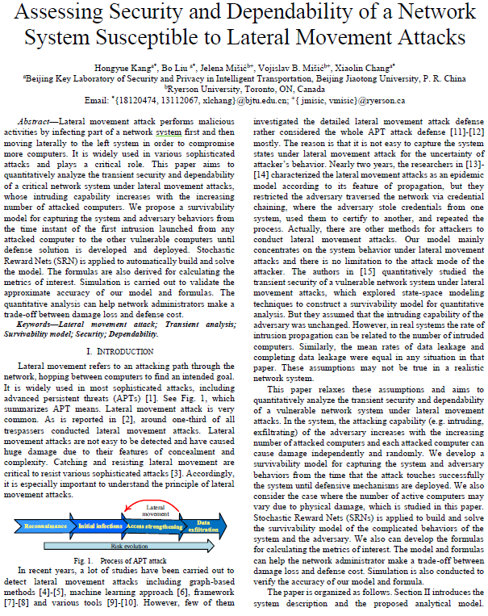
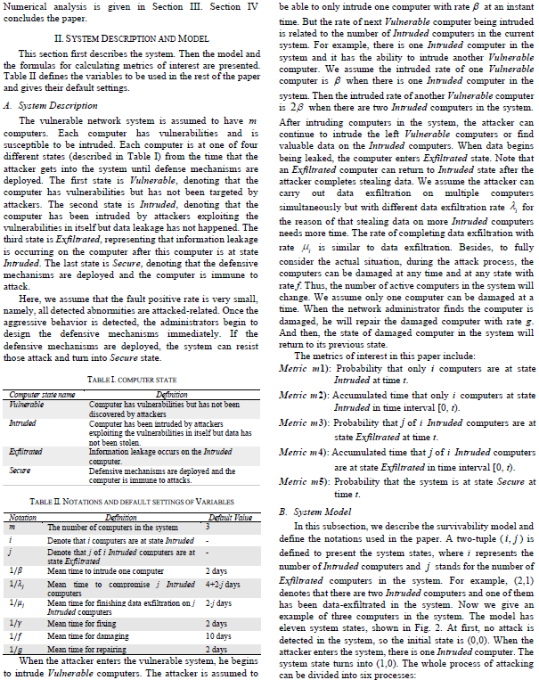
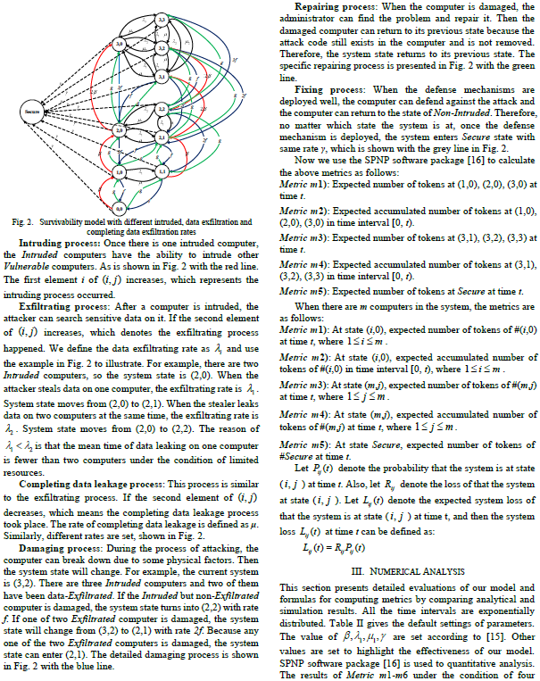
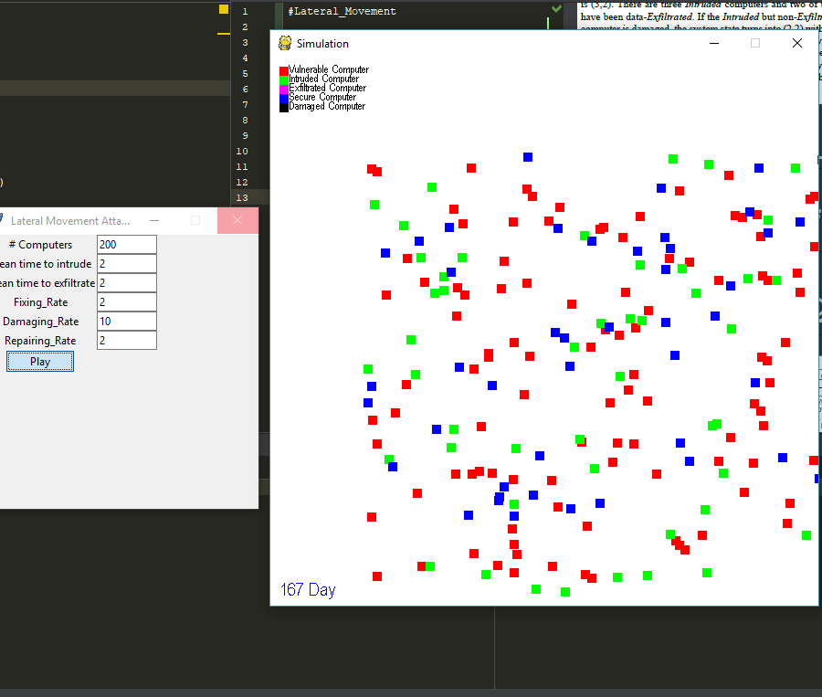
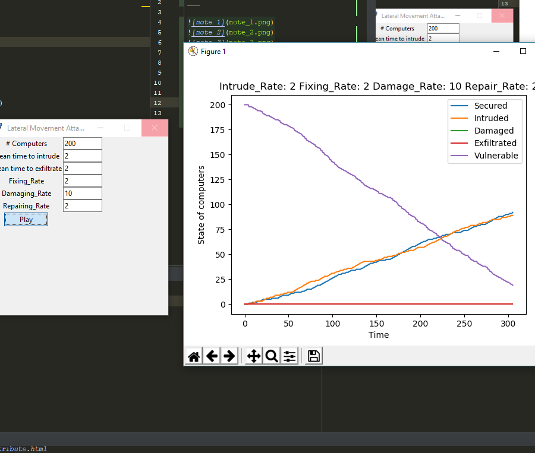
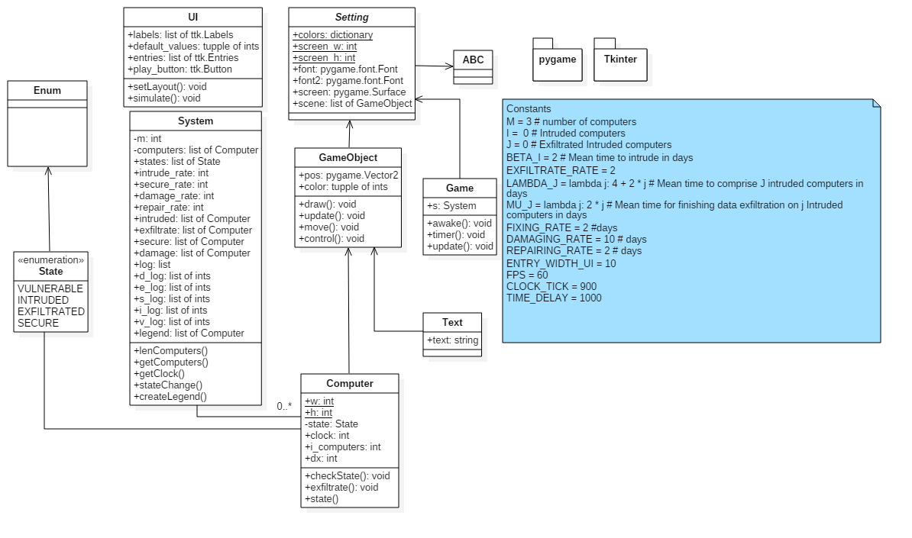

#Lateral_Movement
___





##Read from lateral_movement.pdf for more info
---
#screen shots of the simulation


#UML of the program

#Install pygame
```bash
pip intsall pygame
```
to run the program
```bash
python main.py
    or 
python3 main.py
```
